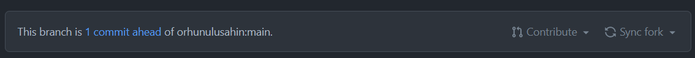

# Key Practices for the Language Scientist

## Assignment Session 2

This is the assignment prompt for the GIT session of the Key Practices for the Language Scientist course.
We would like you to fork this repository into your own GitHub account, and make some changes, and send a pull request to the original repository. In the end, we'll have a short markdown-powered presentation to get to know each other a little better!

### Forking the repository

To fork the repository, press the button in the right top corner on GitHub that says "fork".
Note that you need to have a GitHub account and be logged in to do this.

### Cloning the repository

Locate the URL to your forked repository in the GitHub user interface.
This URL should contain both the repository name and your GitHub username, and start with `https://github.com/` and end in `.git`.

- Open a command line on your computer:
  - `Terminal` for Mac
  - `Bash` for Linux
  - `cmd` or `powershell` for Windows
- Navigate to the repository folder (`cd your_path_to_folder`)
- Type in this command (replace `<URL>` with the repository URL): `git clone <URL>`
- There should now be a folder on your computer containing this `readme.md` file as well as a `short_presentation.md`.

`short_presentation.md` follows a particular Markdown template that we will later use to generate a short presentation. The template looks like this:

```markdown
## Orhun Uluşahin

- Institute & Department: MPI - Psychology of Language
- Favorite food: Mantı
- Thoughts on GIT: Yup.

---

## Rosemarije Weterings

- Institute & Department: RU - CLS
- Favorite food: Pizza
- Thoughts on GIT: Cool!

---
## Slide
```

As you probably guessed, the `---` string separates slides in this template, and each slide uses simple Markdown syntax. We would like you to add a slide to this template containing top secret information about where you work, what your favorite food is, and what you think of GIT.

### Pushing your changes and submitting a pull request

Now, we would like you to commit these changes back to your online repository.

- Save edited `short_presentation.md`
- Open a command line
- Navigate to the repository folder
- Add your file to the staging area: `git add short_presentation.md`
- Commit your changes with a sensible commit message (replace `<MESSAGE>`): `git commit -m "<MESSAGE>"`
- Push your commit to the remote: `git push` (if it cannot find the remote: `git push -u origin main`)
- Now you should have pushed your script to your fork of the repository. You can check if it worked by going to [GitHub](github.com), logging in, and going to your forked repository. The file should appear there!

The final step is to submit a pull request. 

- Once you're at your fork of the original repository, GitHub should tell you that you are ahead of the original repostory you forked. This is because you've made changes and committed them. The message should look like this:



- Here, you can click on `Contribute` and submit a pull request. This will bring up a textbox which you should use to inform the maintainer of the original repository about your changes.
- Finally, click the `Submit Pull Request` button, and you're done!
